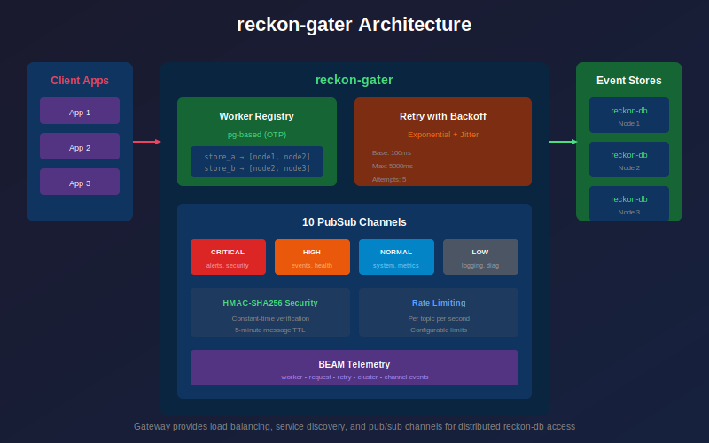
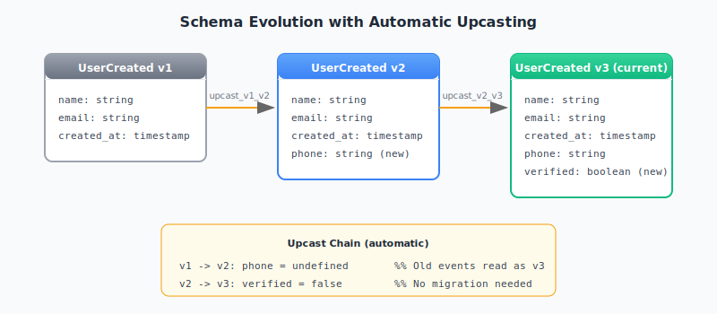
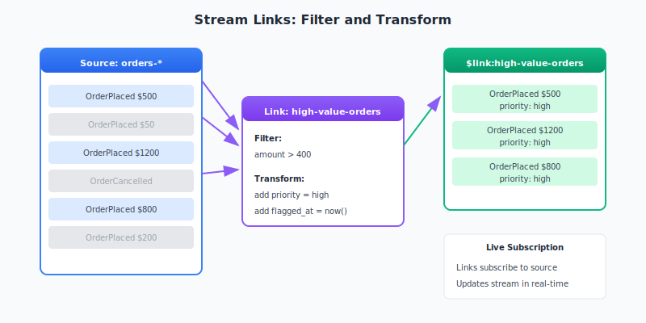
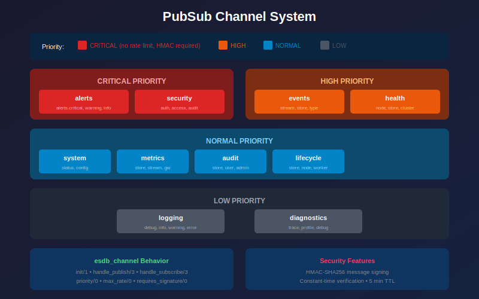
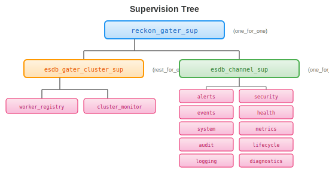
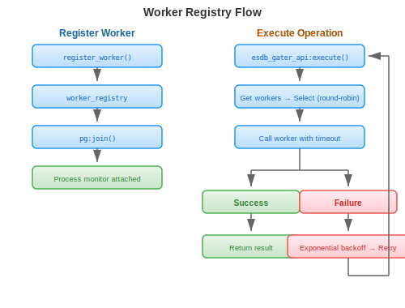
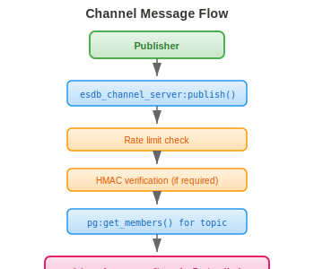
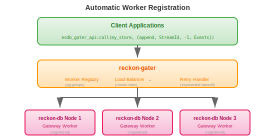
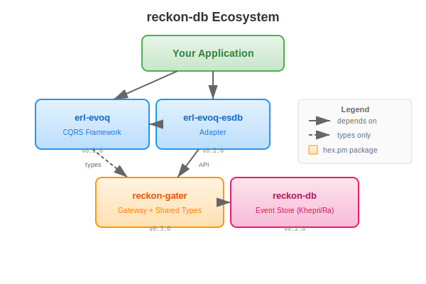

# reckon-gater

[](https://hex.pm/packages/reckon_gater)
[](https://hexdocs.pm/reckon_gater)
[](https://buymeacoffee.com/rlefever)

Gateway for distributed access to [reckon-db](https://codeberg.org/reckon-db-org/reckon-db) event stores.



## Overview

reckon-gater is an Erlang gateway service providing:

- **Distributed Worker Registry**: pg-based registry for cluster-wide worker discovery
- **Load Balancing**: Round-robin with exponential backoff retry
- **Shared Type Definitions**: Common records for events, snapshots, and subscriptions
- **Capability-Based Security**: UCAN-inspired tokens for decentralized authorization
- **PubSub Channels**: 10 dedicated channels with priority-based delivery
- **HMAC Security**: Message signing for critical channels
- **Tamper-Resistance Primitives** *(new in 2.1.0)*: Canonical encoder and HMAC + hash-chain helpers used by `reckon-db` 2.1.0 to make stored events and snapshots tamper-evident. See `reckon_gater_canonical` and `reckon_gater_integrity` modules.
- **DCB Wire API** *(new in 2.3.0)*: `reckon_gater_api:append_if_no_tag_matches/4` plus the `tag_filter()` + `seq_cutoff()` types in `include/reckon_gater_types.hrl`. Cross-stream conditional append with atomic consistency check. See [DCB Guide](guides/dcb.md).
- **CCC Payload Indexes** *(new in 3.5.0)*: `ccc_read_by_payload/4` and `ccc_read_by_payload_hash/4` read from store-side payload indexes, enabling consistency boundaries over JSON payload fields without requiring tags. See [CCC Guide](guides/ccc.md).
- **CCC Index Introspection** *(new in 3.7.0)*: `get_payload_indexes/1` and `get_payload_hash_indexes/1` report which payload fields a store has declared as indexed, so callers can tell whether a `ccc_read_by_payload/4` will be an indexed lookup or a full-store scan. See [CCC Guide](guides/ccc.md).
- **Telemetry**: BEAM telemetry with optional OpenTelemetry exporters

### Versions

| Component | Version |
|---|---|
| `reckon_gater` (this repo) | 3.7.1 |
| `telemetry` (dep) | 1.3.0 |
| Erlang/OTP | 27+ |

reckon-gater has **no** Reckon dependencies: it defines the shared types and
protocols every other library in the [Reckon stack](#reckon-stack) consumes.
Pure Erlang, no native dependencies.

## Installation

Add to your `rebar.config`:

```erlang
{deps, [
    {reckon_gater, "~> 3.7"}
]}.
```

Pure Erlang implementation - works everywhere, no native dependencies.

## Quick Start

```erlang
%% Start the application (typically started by reckon-db)
application:ensure_all_started(reckon_gater).

%% Append events to a stream
Events = [#{type => <<"user_registered_v1">>, data => #{name => <<"Alice">>}}],
{ok, Version} = reckon_gater_api:append_events(my_store, <<"users-123">>, Events).

%% Read events from a stream
{ok, EventList} = reckon_gater_api:stream_forward(my_store, <<"users-123">>, 0, 100).

%% Subscribe to PubSub channel
ok = reckon_gater_channel_server:subscribe(reckon_gater_channel_events, <<"user.*">>, self()).

%% Receive channel messages
receive
    {channel_message, reckon_gater_channel_events, _Topic, Event} ->
        handle_event(Event)
end.
```

## API Reference

### Stream Operations

```erlang
%% Append events to a stream
reckon_gater_api:append_events(StoreId, StreamId, Events) ->
    {ok, NewVersion} | {error, term()}.
reckon_gater_api:append_events(StoreId, StreamId, ExpectedVersion, Events) ->
    {ok, NewVersion} | {error, term()}.

%% Read events from a stream
reckon_gater_api:get_events(StoreId, StreamId, StartVersion, Count, Direction) ->
    {ok, [Event]} | {error, term()}.
reckon_gater_api:stream_forward(StoreId, StreamId, StartVersion, Count) ->
    {ok, [Event]} | {error, term()}.
reckon_gater_api:stream_backward(StoreId, StreamId, StartVersion, Count) ->
    {ok, [Event]} | {error, term()}.

%% Stream metadata
reckon_gater_api:get_version(StoreId, StreamId) -> {ok, Version} | {error, term()}.
reckon_gater_api:stream_exists(StoreId, StreamId) -> boolean().
reckon_gater_api:get_streams(StoreId) -> {ok, [StreamId]} | {error, term()}.
```

### Subscription Operations

```erlang
%% Create a subscription
reckon_gater_api:save_subscription(StoreId, Type, Selector, Name, StartFrom, Subscriber) ->
    ok | {error, term()}.

%% Remove a subscription
reckon_gater_api:remove_subscription(StoreId, Type, Selector, Name) ->
    ok | {error, term()}.

%% Acknowledge event processing
reckon_gater_api:ack_event(StoreId, StreamId, SubscriptionName, EventNumber) ->
    ok | {error, term()}.

%% List subscriptions
reckon_gater_api:get_subscriptions(StoreId) -> {ok, [Subscription]} | {error, term()}.
```

### Snapshot Operations

```erlang
%% Record a snapshot
reckon_gater_api:record_snapshot(StoreId, SourceUuid, StreamUuid, Version, Record) ->
    ok | {error, term()}.

%% Read a snapshot
reckon_gater_api:read_snapshot(StoreId, SourceUuid, StreamUuid, Version) ->
    {ok, Snapshot} | {error, term()}.

%% Delete a snapshot
reckon_gater_api:delete_snapshot(StoreId, SourceUuid, StreamUuid, Version) ->
    ok | {error, term()}.

%% List snapshots
reckon_gater_api:list_snapshots(StoreId, SourceUuid, StreamUuid) ->
    {ok, [Snapshot]} | {error, term()}.
```

### Health

```erlang
reckon_gater_api:health() -> healthy | {degraded, Reason} | {unhealthy, Reason}.
reckon_gater_api:quick_health_check(StoreId) -> ok | {error, term()}.
```

### Temporal Queries

Query events by timestamp for point-in-time reconstruction. See [Temporal Queries Guide](guides/temporal_queries.md).

```erlang
%% Read events up to a timestamp
reckon_gater_api:read_until(StoreId, StreamId, Timestamp) ->
    {ok, [Event]} | {error, term()}.
reckon_gater_api:read_until(StoreId, StreamId, Timestamp, Opts) ->
    {ok, [Event]} | {error, term()}.

%% Read events in a time range
reckon_gater_api:read_range(StoreId, StreamId, FromTs, ToTs) ->
    {ok, [Event]} | {error, term()}.

%% Get stream version at a specific timestamp
reckon_gater_api:version_at(StoreId, StreamId, Timestamp) ->
    {ok, Version} | {error, term()}.
```

### Scavenging

Remove old events beyond retention, optionally archive first. See [Scavenging Guide](guides/scavenging.md).

```erlang
%% Scavenge a stream (delete old events)
reckon_gater_api:scavenge(StoreId, StreamId, Opts) ->
    {ok, Result} | {error, term()}.

%% Scavenge streams matching a pattern
reckon_gater_api:scavenge_matching(StoreId, Pattern, Opts) ->
    {ok, [Result]} | {error, term()}.

%% Preview what would be deleted (dry run)
reckon_gater_api:scavenge_dry_run(StoreId, StreamId, Opts) ->
    {ok, Preview} | {error, term()}.
```

### DCB / CCC Operations

Conditional append with atomic consistency check. See [CCC Guide](guides/ccc.md)
and [DCB Guide](https://codeberg.org/reckon-db-org/reckon-db/src/branch/main/guides/dcb.md).

```erlang
%% Conditional append: write events only if no matching events appeared
%% after seq_cutoff. Returns {ok, LastSeq} or {error, {context_changed, MaxSeq}}.
reckon_gater_api:append_if_no_tag_matches(StoreId, Filter, SeqCutoff, Events) ->
    {ok, pos_integer()} | {error, {context_changed, pos_integer()}} | {error, term()}.

%% Read events from the tag index (for DCB / tag-based CCC context reads)
reckon_gater_api:read_by_tags(StoreId, Tags) ->
    {ok, [Event]} | {error, term()}.
reckon_gater_api:read_by_tags(StoreId, Tags, Opts) ->
    {ok, [Event]} | {error, term()}.

%% Read events from the event-type index
reckon_gater_api:read_by_event_types(StoreId, EventTypes, BatchSize) ->
    {ok, [Event]} | {error, term()}.

%% Read events from the payload index (CCC payload-based context reads)
reckon_gater_api:ccc_read_by_payload(StoreId, Key, Value, Limit) ->
    {ok, [Event]} | {error, term()}.

%% Read events from the composite payload-hash index
reckon_gater_api:ccc_read_by_payload_hash(StoreId, Keys, Values, Limit) ->
    {ok, [Event]} | {error, term()}.

%% Introspect which payload fields the store has declared as indexed.
%% Check before a payload read to know whether it is an indexed lookup
%% (O(matches)) or a full-store scan.
reckon_gater_api:get_payload_indexes(StoreId) ->
    {ok, [binary()]} | {error, term()}.
reckon_gater_api:get_payload_hash_indexes(StoreId) ->
    {ok, [[binary()]]} | {error, term()}.
```

### Causation Metadata

Events carry `causation_id` and `correlation_id` metadata fields (see the
event record in `include/reckon_gater_types.hrl`). There is no dedicated
query API for causation: lineage queries are a read-model concern. See
[Causation Guide](guides/causation.md).

### Schema Operations

Schema registry with automatic upcasting. See [Schema Evolution Guide](guides/schema_evolution.md).



```erlang
%% Register a schema
reckon_gater_api:register_schema(StoreId, EventType, Schema) -> ok.

%% Get schema for an event type
reckon_gater_api:get_schema(StoreId, EventType) ->
    {ok, Schema} | {error, not_found}.

%% List all schemas
reckon_gater_api:list_schemas(StoreId) -> {ok, [SchemaInfo]}.

%% Upcast events to current schema version
reckon_gater_api:upcast_events(StoreId, Events) ->
    {ok, UpcastedEvents} | {error, term()}.

%% Unregister a schema
reckon_gater_api:unregister_schema(StoreId, EventType) -> ok.
```

### Memory Pressure

Adaptive behavior based on system memory. See [Memory Pressure Guide](guides/memory_pressure.md).

```erlang
%% Get current memory pressure level
reckon_gater_api:get_memory_level(StoreId) ->
    {ok, normal | elevated | critical}.

%% Get detailed memory statistics
reckon_gater_api:get_memory_stats(StoreId) ->
    {ok, #{used := bytes(), total := bytes(), level := atom()}}.
```

### Stream Links

Create derived streams from source streams. See [Stream Links Guide](guides/stream_links.md).



```erlang
%% Create a new link (filter + transform)
reckon_gater_api:create_link(StoreId, LinkSpec) -> ok.

%% Delete a link
reckon_gater_api:delete_link(StoreId, LinkName) -> ok.

%% Get link by name
reckon_gater_api:get_link(StoreId, LinkName) ->
    {ok, LinkInfo} | {error, not_found}.

%% List all links
reckon_gater_api:list_links(StoreId) -> {ok, [LinkInfo]}.

%% Start/stop a link
reckon_gater_api:start_link(StoreId, LinkName) -> ok.
reckon_gater_api:stop_link(StoreId, LinkName) -> ok.

%% Get detailed link info
reckon_gater_api:link_info(StoreId, LinkName) ->
    {ok, #{status := atom(), events_processed := integer()}}.
```

### Channels

```erlang
%% Subscribe to a topic
reckon_gater_channel_server:subscribe(ChannelName, Topic, Pid) -> ok.

%% Subscribe with capability token (for authorization)
reckon_gater_channel_server:subscribe(ChannelName, Topic, Pid, CapabilityToken) ->
    ok | {error, {unauthorized, Reason}}.

%% Unsubscribe from a topic
reckon_gater_channel_server:unsubscribe(ChannelName, Topic, Pid) -> ok.

%% Publish a message
reckon_gater_channel_server:publish(ChannelName, Topic, Message) ->
    ok | {error, rate_limited | signature_required | invalid_signature}.

%% Publish with capability token (for authorization)
reckon_gater_channel_server:publish(ChannelName, Topic, Message, CapabilityToken) ->
    ok | {error, {unauthorized, Reason}}.
```

### Security

```erlang
%% Sign a message with default secret
reckon_gater_pubsub_security:sign(Message) -> SignedMessage.

%% Sign with custom secret
reckon_gater_pubsub_security:sign(Message, Secret) -> SignedMessage.

%% Verify a signed message
reckon_gater_pubsub_security:verify(SignedMessage) -> ok | {error, Reason}.

%% Set the default secret
reckon_gater_pubsub_security:set_secret(Secret) -> ok.
```

### Retry Configuration

```erlang
%% Create custom retry config
Config = reckon_gater_retry:new_config(
    100,     %% base_delay_ms
    5000,    %% max_delay_ms
    5        %% max_attempts
),

%% Execute with custom retry
reckon_gater_api:execute(my_store, Fun, Config).
```

## PubSub Channels



The gateway provides 10 dedicated PubSub channels:

| Channel | Priority | Rate Limit | HMAC | Purpose |
|---------|----------|------------|------|---------|
| `reckon_gater_channel_alerts` | critical | unlimited | required | Critical system alerts |
| `reckon_gater_channel_security` | critical | unlimited | required | Security events |
| `reckon_gater_channel_events` | high | unlimited | optional | Business events |
| `reckon_gater_channel_health` | high | 100/sec | optional | Health checks |
| `reckon_gater_channel_system` | normal | unlimited | optional | System notifications |
| `reckon_gater_channel_metrics` | normal | 10000/sec | optional | Performance metrics |
| `reckon_gater_channel_audit` | normal | unlimited | optional | Audit trail |
| `reckon_gater_channel_lifecycle` | normal | unlimited | optional | Lifecycle events |
| `reckon_gater_channel_logging` | low | 1000/sec | optional | Log messages |
| `reckon_gater_channel_diagnostics` | low | 100/sec | optional | Diagnostic info |

### Channel Priorities

- **critical**: Immediate delivery, no rate limiting, HMAC required
- **high**: Priority delivery, minimal rate limiting
- **normal**: Standard delivery
- **low**: Background delivery, may be rate limited

## Architecture

### Supervision Tree



### Worker Registry Flow



### Channel Message Flow



## Configuration

```erlang
%% sys.config
[{reckon_gater, [
    %% Cluster configuration
    {cluster, [
        {port, 45893},
        {multicast_addr, {239, 255, 0, 2}}
    ]},

    %% Retry defaults
    {retry, [
        {base_delay_ms, 100},
        {max_delay_ms, 30000},
        {max_attempts, 10}
    ]},

    %% Channel configuration
    {channels, [
        {reckon_gater_channel_events, [
            {priority, high}
        ]},
        {reckon_gater_channel_metrics, [
            {max_rate, 10000}
        ]}
    ]},

    %% Security
    {security, [
        {hmac_secret, <<"your_secret_here">>},
        {message_ttl_seconds, 300}
    ]},

    %% Telemetry
    {telemetry_handlers, [logger]}
]}].
```

## Telemetry Events

| Event | Measurements | Metadata |
|-------|--------------|----------|
| `[reckon_gater, worker, registered]` | system_time | store_id, node, pid |
| `[reckon_gater, worker, unregistered]` | system_time | store_id, pid |
| `[reckon_gater, worker, lookup]` | duration | store_id |
| `[reckon_gater, request, start]` | system_time | store_id, request_type |
| `[reckon_gater, request, stop]` | duration | store_id, request_type, result |
| `[reckon_gater, request, error]` | duration | store_id, request_type, reason |
| `[reckon_gater, retry, attempt]` | delay_ms, attempt | store_id, reason |
| `[reckon_gater, retry, exhausted]` | total_attempts | store_id, reason |
| `[reckon_gater, cluster, node, up]` | system_time | node, member_count |
| `[reckon_gater, cluster, node, down]` | system_time | node, member_count |
| `[reckon_gater, channel, broadcast]` | recipient_count | channel, topic |

### Attaching Handlers

```erlang
%% Attach default logger handler
ok = reckon_gater_telemetry:attach_default_handler().

%% Attach custom handler
Handler = fun(Event, Measurements, Meta, Config) ->
    %% Your custom handling
    ok
end,
ok = reckon_gater_telemetry:attach(my_handler, Handler, #{}).

%% Detach handler
ok = reckon_gater_telemetry:detach(my_handler).
```

## Building

```bash
rebar3 compile         # Compile
rebar3 eunit           # Unit tests (44 tests)
rebar3 ct              # Integration tests (8 tests)
rebar3 dialyzer        # Type checking
```

## Testing

Test counts:
- **Unit tests**: 44 tests (retry, security, telemetry)
- **Integration tests**: 8 tests (channel system)
- **End-to-end tests**: 24 tests (with reckon-db, run from reckon-db)

```bash
rebar3 eunit                                    # All unit tests
rebar3 ct --suite=reckon_gater_channel_SUITE    # Channel tests
```

Run e2e tests from reckon-db:
```bash
cd /path/to/reckon-db
rebar3 ct --suite=test/e2e/reckon_gater_e2e_SUITE
```

## Integration with reckon-db

reckon-gater is designed to work with [reckon-db](https://codeberg.org/reckon-db-org/reckon-db) to provide load-balanced, distributed access to event stores.

### Automatic Worker Registration

When both packages are deployed on the same nodes:

1. **reckon-db** gateway workers automatically register with **reckon-gater**
2. No manual registration is required
3. Worker cleanup is automatic when nodes leave or workers crash



### Accessing the Event Store

Use the gateway API to access reckon-db with automatic load balancing and retry:

```erlang
%% Stream operations
{ok, Version} = reckon_gater_api:append_events(my_store, StreamId, Events).
{ok, Version} = reckon_gater_api:append_events(my_store, StreamId, ExpectedVersion, Events).
{ok, Events} = reckon_gater_api:stream_forward(my_store, StreamId, 0, 100).
{ok, Events} = reckon_gater_api:stream_backward(my_store, StreamId, 100, 50).
{ok, Version} = reckon_gater_api:get_version(my_store, StreamId).
true = reckon_gater_api:stream_exists(my_store, StreamId).

%% Subscription operations
ok = reckon_gater_api:save_subscription(my_store, stream, StreamId, <<"my_sub">>, 0, self()).
ok = reckon_gater_api:remove_subscription(my_store, stream, StreamId, <<"my_sub">>).
ok = reckon_gater_api:ack_event(my_store, StreamId, <<"my_sub">>, EventNumber).
{ok, Subs} = reckon_gater_api:get_subscriptions(my_store).

%% Snapshot operations
ok = reckon_gater_api:record_snapshot(my_store, SourceUuid, StreamUuid, Version, Record).
{ok, Snap} = reckon_gater_api:read_snapshot(my_store, SourceUuid, StreamUuid, Version).
ok = reckon_gater_api:delete_snapshot(my_store, SourceUuid, StreamUuid, Version).
{ok, Snaps} = reckon_gater_api:list_snapshots(my_store, SourceUuid, StreamUuid).

%% Health check
healthy = reckon_gater_api:health().
ok = reckon_gater_api:quick_health_check(my_store).
```

### Deployment

reckon-db includes reckon-gater as a dependency. Starting reckon-db automatically starts the gateway:

```erlang
%% Start reckon-db (includes gater)
application:ensure_all_started(reckon_db).

%% Gateway workers auto-register with the pg-based registry
%% Use the gater API for all operations
{ok, Version} = reckon_gater_api:append_events(my_store, StreamId, Events).
```

In a multi-node cluster, each node runs reckon-db with its gateway worker. The pg-based registry provides:
- Cluster-wide worker discovery via `pg:get_members/2`
- Eventual consistency (workers visible across all nodes)
- Automatic cleanup on node failure (pg membership)
- Load balancing with round-robin selection
- Exponential backoff retry on failures

## Shared Types

reckon-gater provides shared type definitions used across the ecosystem. Include them in your modules:

```erlang
-include_lib("reckon_gater/include/reckon_gater_types.hrl").
```

### Records

| Record | Purpose |
|--------|---------|
| `#event{}` | Event with type, data (Erlang term), and metadata |
| `#snapshot{}` | Aggregate snapshot at a specific version |
| `#subscription{}` | Subscription state and configuration |
| `#append_result{}` | Result of an append operation |

### Version Constants

| Constant | Value | Purpose |
|----------|-------|---------|
| `?NO_STREAM` | -1 | Stream must not exist (first write) |
| `?ANY_VERSION` | -2 | No version check, always append |
| `?STREAM_EXISTS` | -4 | Stream must exist |

See the [Shared Types Guide](guides/shared_types.md) for detailed usage.

## Reckon stack



reckon-gater is one library in the Reckon event-sourcing ecosystem. In dependency order (a library only knows about the ones above it):

- **[reckon-proto](https://codeberg.org/reckon-db-org/reckon-proto)**: the wire-contract protobufs; source of truth for the gateway surface.
- **reckon-gater (this repo)**: shared types and protocols (event, snapshot, subscription, DCB/CCC tag_filter) plus the store-worker registry API. No Reckon dependencies.
- **[reckon-db](https://codeberg.org/reckon-db-org/reckon-db)**: BEAM-native event store. Depends on reckon_gater, khepri, ra.
- **[reckon-nifs](https://codeberg.org/reckon-db-org/reckon-nifs)**: standalone Rust NIF helpers with pure-Erlang fallbacks.
- **[evoq](https://codeberg.org/reckon-db-org/evoq)**: standalone CQRS/event-sourcing framework; no Reckon dependencies.
- **[reckon-evoq](https://codeberg.org/reckon-db-org/reckon-evoq)**: adapter wiring evoq to a Reckon store. Depends on evoq and reckon_gater; not on reckon_db (reaches the store through the gater API).
- **[reckon-gateway](https://codeberg.org/reckon-db-org/reckon-gateway)**: gRPC + HTTP/JSON ingress. Consumes reckon_gater; can embed reckon_db or federate remote clusters.
- **[reckon-go](https://codeberg.org/reckon-db-org/reckon-go)**: the Go client; talks to reckon-gateway.
- **reckon-portal**: docs and landing site ([reckon-internal/reckon-portal](https://codeberg.org/reckon-internal/reckon-portal)).

## License

Apache-2.0
